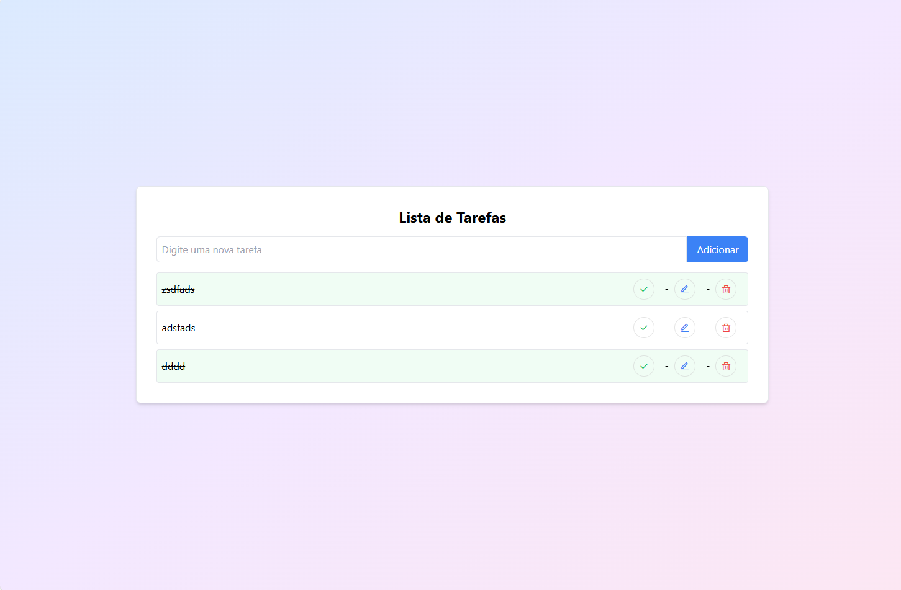

# 📋 Todo App - Aplicação de Lista de Tarefas



Essa uma uma aplicação web simples e moderna de lista de tarefas, resultado da atividade 05 do curso Curso Full Stack Java da MaispraTi.
Desenvolvida com HTML, Tailwind CSS e JavaScript, utilizando localStorage para persistência de dados.


## ✨ Funcionalidades

- **Adicionar Tarefas**: Criar novas tarefas rapidamente
- **Editar Tarefas**: Modificar o texto das tarefas existentes
- **Excluir Tarefas**: Remover tarefas que não são mais necessárias
- **Marcar como Concluída**: Destacar tarefas finalizadas
- **Persistência de Dados**: Tarefas salvas no localStorage

## 🛠️ Tecnologias Utilizadas

- HTML5
- Tailwind CSS
- JavaScript
- localStorage
- Remix Icons

## 📦 Instalação e Uso

### Pré-requisitos

- Navegador web moderno (Chrome, Firefox, Safari, Edge)
- Conexão à internet (para carregar CDNs)

### Passos para Execução

1. Clone o repositório:
```bash
git clone https://https://github.com/JailsonMR/MaispraTi/tree/main/3-module03/Atividade05.git
```

2. Navegue até o diretório do projeto:
```bash
cd Atividade05
```

3. Abra o arquivo `index.html` diretamente no seu navegador


## 🎨 Design

- Interface responsiva
- Fundo gradiente
- Estilização moderna com Tailwind CSS
- Ícones do Remix Icons


## 🌟 Autor

Jailson Miranda
- LinkedIn: https://www.linkedin.com/in/jailson-miranda/